# Kheleel App — Detailed Report

> **For developers:** Any new UI or feature must follow the **Developer UI Design Language** (Section 2.1). The home page (`app/page.tsx`) and `DESIGN_BIBLE.md` are the canonical references.

## 1. App Overview

### Purpose
**Kheleel** (خليل) is an Arabic-first AI chat application. It targets Arab users across dialects, supports Fusha or Easy Arabic responses, and provides voice input/output for natural Arabic conversation.

### Tech Stack
| Layer | Technology |
|-------|------------|
| Framework | Next.js (App Router) |
| Styling | Tailwind CSS + CSS variables |
| AI | AWS Bedrock |
| Voice (TTS) | Amazon Polly (neural, Zeina voice) |
| Voice (STT) | Web Speech API (browser) |
| Storage | DynamoDB, S3 |
| Fonts | Aref Ruqaa, Amiri, Noto Naskh Arabic, Noto Nastaliq Urdu |

### Main Routes
- **`/`** — Home: logo, tagline, input pill (with mic, attachment)
- **`/chat`** — Chat UI: sidebar, messages, controls bar, input pill
- **`/admin/*`** — Admin: data, taglines, characters, lexicons

### Data Flow
```
Home → User types/speaks → handleSend → /chat?m=... or sessionStorage
Chat → sendMessage → POST /api/chat → Bedrock → Response stored
Voice TTS → SpeakButton → POST /api/voice/synthesize → Polly → MP3 → Audio.play()
```

---

## 2. UI/UX

### Layout
- **RTL**: `dir="rtl"` on `html` and main containers.
- **Sidebar**: Right side, collapsible (280px expanded / 72px collapsed). Sections: فهرس, أدوات, خليخانة.
- **Main area**: Left in RTL; centered content, max-width ~2xl.

### Design System
- **CSS variables** (`app/globals.css`): `--color-accent`, `--color-accent-tint-*`, `--background`, `--foreground`.
- **Accent color**: User-configurable via `lib/theme-color.ts`; stored in `localStorage`; `derivePalette()` generates tints, avatar, earth.
- **Tailwind** (`tailwind.config.ts`): Uses `var(--background)`, `var(--foreground)`, `var(--color-accent)`; `font-ui`, `font-title`, `font-body`, `font-poetry`.

### Themes
- **ThemeProvider** + **ThemeColorProvider** for light/dark and accent.
- **Light mode** (`[data-theme="light"]`): Light gradient, `--foreground: #0e0e0e`.
- **Dark mode**: Default dark background with `--background: #0e0e0e`.

### Key Components
- **HomePillInput**: Pill input + send + mic + attachment.
- **ChatMessage**: User/assistant bubbles; `SpeakButton` for assistant messages.
- **BirdToggle**: Bird icon for sidebar expand/collapse.
- **SettingsModal**: Settings, accent color picker, language style.

---

## 2.1 Developer UI Design Language (Mandatory)

**All developers building or modifying UI in this app MUST follow the design language defined by the current home page and design system.** Do not introduce new visual patterns, colors, or typography that deviate from this standard.

### Canonical Reference
- **Primary reference:** `app/page.tsx` (home page) — treat it as the source of truth for layout, spacing, and component styling.
- **Design rules:** `DESIGN_BIBLE.md` — strict rules for fonts, colors, RTL, and layout.
- **Tokens:** `app/globals.css` — CSS variables; `tailwind.config.ts` — Tailwind theme.

### Colors
- **Accent:** Use `var(--color-accent)` (or Tailwind `gold` / `kheleel-gold`). Never hardcode `#C68E17`.
- **Accent variants:** `--color-accent-hover`, `--color-accent-tint-12`, `-tint-08`, `-tint-20`, `-tint-25`, `-tint-10`, `-tint-06`, `-tint-40`.
- **Avatar/earth:** `--color-accent-avatar-expanded`, `--color-accent-avatar-collapsed`, `--color-earth`.
- **Neutrals:** `#231f20` (text), `#6b6b6b` (muted), `#8c8c8c` (subtle), `#e5e5e5` (borders), `#fafafa` (light bg), `#ebebec` (light surface).

### Typography
- **Fonts:** Only Aref Ruqaa, Amiri, Noto Naskh Arabic, Noto Nastaliq Urdu (see `DESIGN_BIBLE.md`).
- **UI text:** `font-ui` (Noto Naskh Arabic).
- **Body:** `font-body` (Amiri).
- **Titles:** `font-title` (Aref Ruqaa).

### Layout & Spacing
- **RTL:** `dir="rtl"` on containers; `text-align: right`; use logical properties (`marginInlineStart`, `paddingInlineEnd`).
- **Sidebar:** 280px expanded / 72px collapsed; sections: فهرس, أدوات, خليخانة.
- **Corners:** `border-radius` 16–28px; `--tile-radius: 28px` for cards.
- **Max width:** `max-w-2xl` for main content.

### Components to Reuse
- **HomePillInput** — for all chat input areas.
- **SidebarSection** pattern — `rounded-lg border border-[#e5e5e5] p-3 bg-[#fafafa]`.
- **Buttons:** `rounded-lg`, `hover:bg-black/5` or `hover:text-[var(--color-accent)]`, `transition-colors`.

### Do Not
- Add new fonts.
- Use hardcoded gold/earth colors; use CSS variables.
- Introduce emojis in the UI.
- Use icons outside Google Material Symbols (or existing Lucide usage in voice components).
- Break RTL or mirror icons incorrectly.

---

## 3. Input & Voice Features (Primary Focus)

### 3.1 Mic — Speech-to-Text (User Speaks Arabic to AI)

**Location**

1. **In `HomePillInput`** (second row, below pill):
   - File: `components/HomePillInput/HomePillInput.tsx` (lines 119–127)
   - Rendered when `onMicTranscript` is passed.
   - Uses `MicButton` with `variant="minimal"`.

2. **Voice overlay** (chat page):
   - File: `app/chat/page.tsx` (lines 692–699)
   - Button labeled "صوت" in the controls bar.
   - Opens `VoiceOverlay` for full-screen voice input.

**How it works**

| Component | File | Behavior |
|-----------|------|----------|
| **MicButton** | `components/Voice/MicButton.tsx` | `SpeechRecognition` / `webkitSpeechRecognition`, `lang = "ar-SA"`, `continuous = false`, `interimResults = false`. On click: start/stop. `onresult` → `event.results[0][0].transcript` → `onTranscript(text)`. |
| **VoiceOverlay** | `components/Voice/VoiceOverlay.tsx` | Same Web Speech API; `continuous = true`, `interimResults = true`. Full-screen overlay with animated orb. States: idle, listening, speaking. |

**Data flow**

- **Home**: `onMicTranscript={handleTranscript}` → `setInput(text)`.
- **Chat**: `onMicTranscript` → `setInput(""); void sendMessage(text);`.
- **Voice overlay**: `onTranscript` → `sendMessage(text); setVoiceOverlayOpen(false)`.

**Visual**

- MicButton: Mic/MicOff icons; pulse when recording (`mic-recording-pulse`).
- VoiceOverlay: Orb (red when listening, accent when speaking).

---

### 3.2 Speak / Voice Icon — Text-to-Speech (AI Speaks Arabic to User)

**Location**

- In each assistant message bubble.
- File: `components/Chat/ChatMessage.tsx` (line 32)
- `showSpeak={msg.role === "assistant"}` → renders `SpeakButton` for assistant messages.
- Icon: `Volume2` (speaker), `Loader2` when loading, `VoiceWaveIcon` when speaking.

**How it works**

| Component | File | Behavior |
|-----------|------|----------|
| **SpeakButton** | `components/Voice/SpeakButton.tsx` | On click: `POST /api/voice/synthesize` with `{ text }`. Response: MP3 blob → `URL.createObjectURL` → `new Audio()` → `audio.play()`. Fallback: `SpeechSynthesisUtterance` with `u.lang = "ar-SA"` if API fails. |
| **API** | `app/api/voice/synthesize/route.ts` | Calls `synthesizeSpeech(text)` from `lib/aws/polly.ts`. |
| **Polly** | `lib/aws/polly.ts` | `SynthesizeSpeechCommand` with `Engine: "neural"`, `VoiceId: "Zeina"` (Arabic), `LanguageCode: "arb"`, `OutputFormat: "mp3"`. |

**Data flow**

```
User clicks SpeakButton → POST /api/voice/synthesize { text } → Polly → MP3
→ Audio.play() → User hears Arabic
```

**Fallback**

- If `POST /api/voice/synthesize` fails, uses browser `SpeechSynthesisUtterance` with `lang = "ar-SA"`.

**Note**

- Settings has `speechSpeed` (0.5–2x) in "الصوت" section, but it is not wired to `SpeakButton` or Polly.

---

## 4. File Reference Summary

| Component / API | Path |
|-----------------|------|
| Home page | `app/page.tsx` |
| Chat page | `app/chat/page.tsx` |
| HomePillInput | `components/HomePillInput/HomePillInput.tsx` |
| MicButton | `components/Voice/MicButton.tsx` |
| SpeakButton | `components/Voice/SpeakButton.tsx` |
| VoiceOverlay | `components/Voice/VoiceOverlay.tsx` |
| ChatMessage | `components/Chat/ChatMessage.tsx` |
| TTS API | `app/api/voice/synthesize/route.ts` |
| Polly | `lib/aws/polly.ts` |
| Theme color | `lib/theme-color.ts` |
| Settings | `components/Settings/SettingsModal.tsx` |

---

## 5. Voice Flow Diagram

```mermaid
flowchart TB
    subgraph mic [Mic - User Speaks Arabic]
        U1[User clicks Mic]
        U1 --> SR[Web Speech API]
        SR -->|"ar-SA"| STT[Speech-to-Text]
        STT -->|transcript| Input[Input or sendMessage]
    end

    subgraph speak [Speak - AI Speaks Arabic]
        U2[User clicks Volume icon]
        U2 --> API[POST /api/voice/synthesize]
        API --> Polly[Amazon Polly]
        Polly -->|Zeina neural| MP3[MP3]
        MP3 --> Audio[Audio.play]
        Audio -->|Fallback| SS[SpeechSynthesis ar-SA]
    end
```


